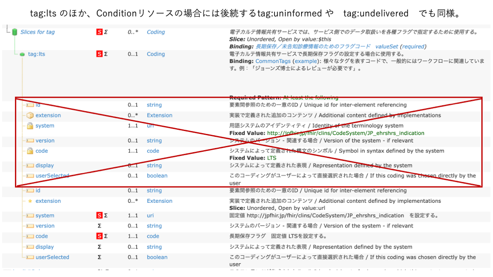

# CLINS電子カルテ情報共有サービス用: 【処方依頼情報】

## 背景および想定シナリオ
このプロファイルは、電子カルテ情報共有サービスに送信するための６情報用に「処方依頼情報」を記述するためのものである。

電子カルテ情報共有サービスに送信する情報に含まれる場合には、本プロファイルを使用すること。
このプロファイルは　JP_MedicationRequest_eCS　プロファイルから派生して定義されているので、詳細は、[処方依頼情報　JP_MedicationRequest_eCS][JP_MedicationRequest_eCS]　を参照のこと。

## プロファイル

【注】プロファイル詳細における「全要素のツリー」表示において、表示系ソフトのバグのため　meta.tag部分の一部で不要な重複表示が発生している。 

