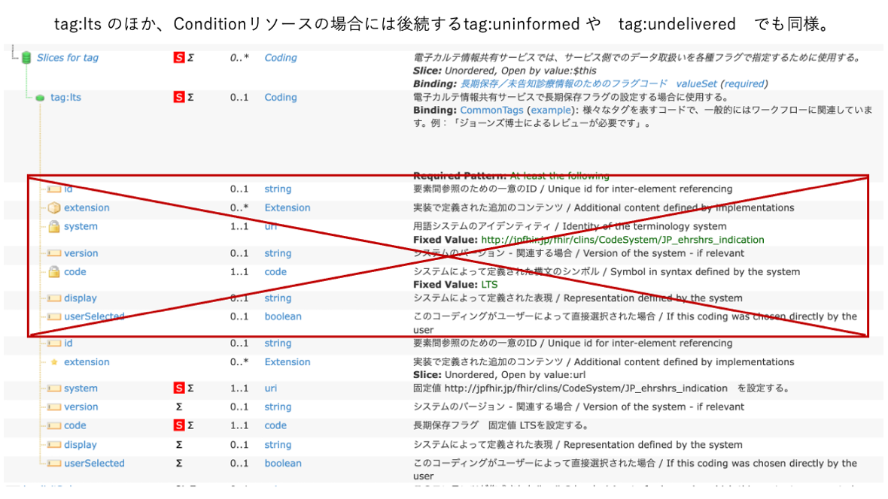

# eCS/CLINS 診療情報・サマリー汎用：【処方依頼情報】

## 背景および想定シナリオ
このプロファイルは、５情報をはじめ、診療情報提供書や退院時サマリーなどの2文書に「処方依頼情報」を記述するためのものである。
電子カルテ情報共有サービスに送信される２文書に含まれる場合、このプロファイルを使用することができる。

## スコープ

### 対象
電子カルテシステムで登録された診療情報提供書、退院時サマリーなどの診療要約記録などに記述される、ひとつひとつの医薬品に関する処方情報を対象とする。

## プロファイル定義における必須要素と推奨要素
  - 必須要素は、その要素が必ず１個以上出現しなければならない要素。FHIR仕様ではMust Supportフラグを設定している。
  - 推奨要素は、送信側はシステムに値が存在しているなら、値を格納した要素が必ず１個以上出現しなければならず、受信側は必ずその値を格納しなければならない要素。FHIR仕様ではMust Supportフラグを設定している。

### 必須要素　（MedicationRequestの直下の必須要素）
  - resourceType : リソースタイプ "MedicationRequest"
  - meta.lastUpdated : 最終更新日時
  - meta.profile : プロファイルURL、バージョン併記必須。
  - identifier : インスタンス識別ID
  - status : 処方状態
  - intent : 投薬指示の意図。"order" を固定で設定する。
  - medicationCodeableConcept : 医薬品のコードと名称。
    - .coding : コード化された情報
    - .coding.system : コード化に用いたコードシステムURL
    - .coding.code : コード化に用いたコード
    - .coding.display : コード化に用いたコードの表示名
    - .text : 処方医薬品名のテキスト記述
  - subject : 対象となる患者のFHIRリソースへの参照。
  - authoredOn : 処方指示が最初に作成された日時。
  - dosageInstruction : 用法や投与量を含む処方指示。
  - dispenseRequest : 調剤（薬局での払い出し指示）情報

### 必須要素　（MedicationRequest.dosageInstructionの直下の必須要素）
  - DosageInstruction[].extension[] : 投与開始日を明示するために使用する拡張「PeriodOfUse」
  - DosageInstruction[].text : dosageInstructionが表す処方指示の文字列表現。
  - DosageInstruction[].timing : 服用タイミング。timing.codeにコード化された用法、timing.textに用法のテキストを記述。

### 条件により必須
  - meta.tag ("LTS") : 電子カルテ情報共有サービス（２文書中に含まれる場合）で長期保存フラグの設定する場合に必須。
  - contained (JP_Encounter) : 電子カルテ情報共有サービス（同）では必須。処方登録時の入院外来区分情報
  - contained (JP_Practitioner) : 電子カルテ情報共有サービス（同）では必須。処方作成者の医療者情報
  - extension (eCS_InstitutionNumber) : 電子カルテ情報共有サービス（同）では必須。医療機関番号１０桁
  - extension (eCS_Department) : 電子カルテ情報共有サービス（同）では必須。診療科名称（とコード）
  - encounter : 電子カルテ情報共有サービス（同）では必須。この情報を記録したときの受診情報（入外区分など）を記述しているcontainedリソース(JP_Encounter) への参照
  - requester : 電子カルテ情報共有サービス（同）では必須。処方者情報。この処方を作成した医療者の情報を記述しているcontainedリソース(JP_Practitioner) への参照。

### 推奨要素
  - category : 薬剤使用区分
  - code.coding.version : 使用したコードシステムのバージョン文字列

### MustSupport要素
  - 必須要素、条件により必須要素、推奨要素は、自動的にMustSupport要素である。それ以外に以下の要素がMustSupport要素である。
  - basedOn : 元の処方オーダ情報。処方オーダ番号等の一意識別子を含むServiceRequestリソース（Containedリソース）への参照。
  - note :  薬剤単位の備考。
  - DosageInstruction[].site : 外用薬の部位
  - DosageInstruction[].route : 投与経路
  - DosageInstruction[].method : 投与方法の基本用法区分
  - DosageInstruction[].doseAndRate : 投与量

## 要素の説明とプロファイル
  - 多重度欄の背景色：
    - 濃い黄色＝「必須要素」に対応する。
    - 薄い黄色＝「条件により必須要素」に対応する。
    - 薄い緑＝「推奨要素」に対応する。
    - 無色＝本要素を記述する場合の説明を参考までに記載しているが多重度は0..1または0..*であるため出現してもしなくてもよい。ただし、MustSupport要素の場合には、MustSupport要素としての仕様を満たす必要がある。MustSupport要素でなければ、データ設定と送信は任意であり、送信しても受信側では無視（破棄）されるかもしれないことに注意すること。
  - この表に現れない要素であるが、JP-Coreでは出現してもよい（多重度が0..1または0..*の）要素は、データ設定と送信は任意であり、送信しても受信側では無視（破棄）されるかもしれないことに注意すること。
  - この表で要素名のあとに[ ]表記があるものは、値が１個であっても、JSONデータのリスト型の値で記述しなければならない。
  - 要素[*] ：　この要素は繰り返し可能であり、値の記述はリストとなる。
  - 要素[+] ：　（繰り返し可能な要素において）新たなひとつの要素の子要素値として記述される。
  - 要素[=] ：　（繰り返し可能な要素において）すぐ上の要素と同じ要素の子要素値として記述される。

## 詳細説明

<h3>表「MedicationRequest」</h3>
<button id="mrc" type="button" onclick="details_open(true,'TableDetails','mrc')">表「MedicationRequest」開く</button>

<button type="button" onclick="details_open(false,'TableDetails', 'mrc')">閉じる</button>



<button type="button" onclick="details_open(false,'TableDetails','mrc')">閉じる</button>

<!-- =========================================== -->
<!-- ====                                   ==== -->
<!-- ====      表（DosageInstruction)　　　　 ==== -->
<!-- ====                                   ==== -->
<!-- =========================================== -->
 

<h3>表「MedicationRequest.DosageInstruction」</h3>
<button id="dic" type="button" onclick="details_open(true,'DosageInstructionDetails', 'dic')">表「MedicationRequest.DosageInstruction」を開く</button>

<button type="button" onclick="details_open(false,'DosageInstructionDetails', 'dic')">閉じる</button>



<button type="button" onclick="details_open(false,'DosageInstructionDetails','dic')">閉じる</button>

 

## プロファイル

【注】プロファイル詳細における「全要素のツリー」表示において、表示系ソフトのバグのため　meta.tag部分の一部で不要な重複表示が発生していることがある。 


