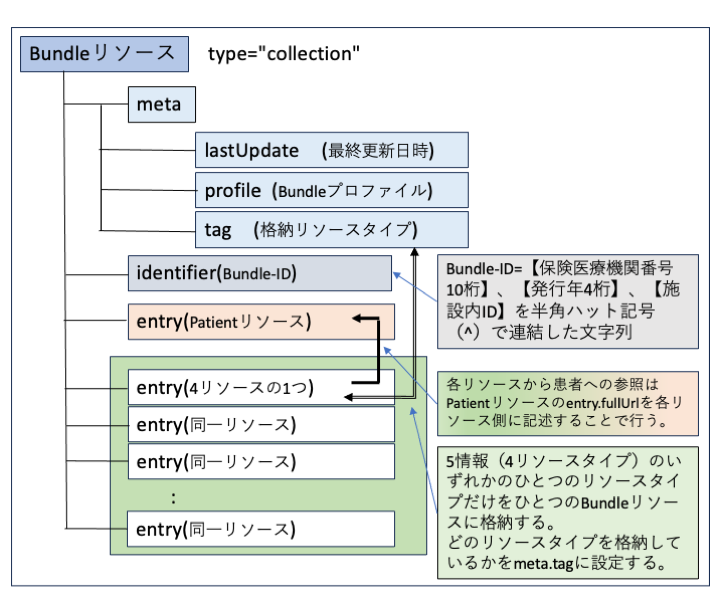

### 電子カルテ情報共有サービスに医療機関から送信するデータのFHIR仕様について
本ページは、国が進めている医療DXのなかでのサービスが検討されている「電子カルテ情報共有サービス」（以下、「CLINS」という。）において扱われる、いわゆる「２文書５情報」のうち、以下の「５情報」を医療機関から送信する際のFHIR仕様に関係する部分を記述したものである。また、送信する各リソースタイプのデータをひとつのFHIR Bundleリソースに格納してまとめて送信するための仕様も記述する。
<br>

#### 5情報、6情報のためのFHIRリソース

##### 使用するFHIRリソースとその仕様の対応

以下の表に5情報、6情報の記述に使用するFHIRリソースとその仕様の対応を示す。


<table border="1"  style="border-collapse: collapse">
<tr>
    <th>区分</th>
    <th>情報種別</th>
    <th>使用するFHIRリソースと仕様名</th>
    <th>備考</th>
</tr>

<tr><td rowspan="5">5情報</td>
    <td>薬剤アレルギー等</td>
    <td rowspan="2">AllergyIntoleranceリソース<br><a href="StructureDefinition-JP-AllergyIntolerance-eCS.html">JP_AllergyIntolerance_eCS</a></td>
    <td>要素category="medication"、"biologic"(当面使用しない)とする。</td>
</tr>

<tr>
    <td>その他アレルギー等</td>
    <td>要素categoryを"food","environment"または要素なしとする。</td>
</tr>

<tr>
    <td>傷病名</td>
    <td>Conditionリソース<br><a href="StructureDefinition-JP-Condition-eCS.html">JP_Condition_eCS</a></td>
    <td></td>
</tr>

<tr>
    <td>検査</td>
    <td rowspan="2">Observationリソース<br><a href="StructureDefinition-JP-Observation-LabResult-eCS.html">JP-Observation-LabResult-eCS</a></td>
    <td rowspan="2">本仕様では「検査結果情報」という。<br>検査項目コードで検査と感染症は区別される。</td>
</tr>

<tr>
    <td>感染症</td>
</tr>

<tr>
    <td></td>
    <td>処方</td>
    <td>MedicationRequestリソース<br><a href="StructureDefinition-JP-MedicationRequest-eCS.html">JP-MedicationRequest-eCS</a></td>
    <td>本仕様では「処方依頼情報」という。</td>
</tr>
</table>

<br>

##### 補足説明


 - 薬剤アレルギー等、その他アレルギー等の情報は、別に説明するように、同じプロファイルに従うAllergyIntoleranceリソースタイプで記述され、category要素に設定される値にもとづいて受信側で区別される。
 - 検査結果情報と感染症情報については、同じプロファイルに従うObservationリソースタイプで記述され、コード化された項目情報の記述にもとづいて受信側で区別される。
 - 処方依頼情報には、注射点滴手法によるものは含まれない。ただし、処方箋によって処方されるものは含まれる（自己注射剤など）。
<br>

* <span style="color: blue;">運用上の注意：処方依頼情報は、５情報のひとつとして単独で（２文書に含まれない形で）CLINSに送信されることはない。しかし、診療情報提供書、退院時サマリーの２文書に処方の内容を記述するために使用され、２文書の情報に埋め込まれてCLINSに送信されるため、その場合にはCLINSで取り出されて利用される。従って2文書に含まれる処方依頼情報は、本仕様にもとづいて記述される必要がある。
</span> 
<br><br>

* 上記のリソースから参照される関連情報<br>
　上記５情報から、その要素情報として参照されるリソースタイプを以下に示す。<span style="color: blue;"> ここに記載されないリソースタイプの情報も２文書ではそれぞれの仕様に従い使用可能である。</span>

  1.  [患者情報	Patientリソース][JP_Patient_eCS]
  1.  [外来受診・入院歴情報	Encounterリソース][JP_Encounter_eCS]
  1.  [医療者情報　Practitionerリソース][JP_Practitioner_eCS]
  1.  [オーダ情報 ServiceRequestリソース JP_ServiceRequest](https://jpfhir.jp/fhir/core/1.1.2/StructureDefinition-JP-ServiceRequest.html)
  1.  [検査検体情報	Sepecimenリソース JP_Specimen](https://jpfhir.jp/fhir/core/1.1.2/StructureDefinition-JP-Specimen.html)

  <span style="color: blue;">上記のうち、患者情報以外のリソースは、５情報では、[埋め込みリソース（containedリソース）](core6spec.html#contained-%E3%83%AA%E3%82%BD%E3%83%BC%E3%82%B9%E5%9F%8B%E3%82%81%E8%BE%BC%E3%81%BF%E3%83%AA%E3%82%BD%E3%83%BC%E3%82%B9%E3%81%AE%E5%8F%96%E3%82%8A%E6%89%B1%E3%81%84)の形で記述される。患者情報のリソースはBundleリソースのひとつのentryとして記述され、５情報からは参照の形をとる。</span>
  <br>

- 2文書（診療情報提供書、退院時サマリー）に含まれる５情報に該当する情報の記述方法：<br>
　2文書の仕様書に記載されている５情報に該当する情報は、本実装ガイドに従い記述するものとする。<br>
  CLINSでは、2文書データは文書として取り扱われるとともに、これらの文書中に記述されている５情報に該当する情報は取り出され管理される。したがって、５情報をCLINSに送信するのと同じ仕様で記述しなければならない。<br>
  
- 2文書に含まれる５情報以外の情報の記載と取り扱い<br>
  2文書に含まれる、５情報以外の情報種別のリソースではcontainedリソースを除き、CLINSでは取り出されて単独で利用されることはない。これらのリソースを2文書内で記述する場合にはそれぞれのFHIR仕様や、JP-Core仕様に従い記述して構わない。<br>
  

#### 送信時の複数リソースデータのまとめ方


##### Bundleリソース（collectionタイプ）の仕様

CLINSに医療機関から送信する場合、１回に送信するリソースデータは、複数のリソースデータから構成されるのが普通である。FHIRではこのような送受信のまとめに、複数リソースデータをひとまりにしたひとつのリソースとしてBundleリソースタイプが用意されている。<br>

| Bundleリソース概要図 |
| ---- |
|  |

Bundleリソースの記述仕様の詳細については、５情報送信用Bundleリソースを参照すること。

### 　５情報をまとめて送信するためのBundleリソースのプロファイル

<table>
         <tr>
            <td style="column-width:30%">
               <a href="StructureDefinition-JP-Bundle-CLINS.html" title="StructureDefinition/JP-Bundle-CLINS">JP_Bundle_CLINS</a>
            </td>
            <td>
<p>CLINS Bundleリソース（CLINS電子カルテ情報共有サービス 送信用Bundleリソース）</p>
</td>
         </tr>
</table>

### 　５情報に該当するリソースと患者リソースのプロファイル

<table>
         <tr>
            <td style="column-width:30%">
               <a href="StructureDefinition-JP-AllergyIntolerance-eCS.html" title="StructureDefinition/JP-AllergyIntolerance-eCS">JP_AllergyIntolerance_eCS</a>
            </td>
            <td>
<p>eCS/CLINS AllergyIntoleranceリソース（アレルギー情報／薬剤アレルギー等）</p>
</td>
         </tr>
         <tr>
            <td style="column-width:30%">
               <a href="https://jpfhir.jp/fhir/eCS/ig/StructureDefinition-JP-Condition-eCS.html" title="StructureDefinition/JP-Condition-eCS">JP_Condition_eCS</a>
            </td>
            <td>
<p>eCS/CLINS Conditionリソース（傷病名情報）</p>
</td>
         </tr>
         <tr>
            <td style="column-width:30%">
               <a href="https://jpfhir.jp/fhir/eCS/ig/StructureDefinition-JP-MedicationRequest-eCS.html" title="StructureDefinition/JP-MedicationRequest-eCS">JP_MedicationRequest_eCS</a>
            </td>
            <td>
<p>eCS/CLINS 診療情報・サマリー汎用 MedicationRequestリソース（処方オーダの１処方薬情報）</p>
</td>
         </tr>
         <tr>
            <td style="column-width:30%">
               <a href="https://jpfhir.jp/fhir/eCS/ig/StructureDefinition-JP-Observation-LabResult-eCS.html" title="StructureDefinition/JP-Observation-LabResult-eCS">JP_Observation_LabResult_eCS</a>
            </td>
            <td>
<p>eCS/CLINS 診療情報・サマリー汎用 Observationリソース（検体検査結果／感染症検体検査結果）</p>
</td>
         </tr>
<tr>
            <td style="column-width:30%">
               <a href="https://jpfhir.jp/fhir/eCS/ig/StructureDefinition-JP-Patient-eCS.html" title="StructureDefinition/JP-Patient-eCS">JP_Patient_eCS</a>
            </td>
            <td>
<p>eCS/CLINS Patientリソース（患者情報）</p>
</td>
         </tr>
   </table>
<br>


### 　５情報の各リソースに埋め込まれるリソースのプロファイル


* ２文書にも含めることができる。

<table>
<tr>
            <td style="column-width:30%">
               <a href="https://jpfhir.jp/fhir/eCS/ig/StructureDefinition-JP-Encounter-eCS.html" title="StructureDefinition/JP-Encounter-eCS">JP_Encounter_eCS</a>
            </td>
            <td>
<p>eCS/CLINS Encounterリソース（受診時・入院時等のEncounter情報）</p>
</td>
         </tr>
<tr>
            <td style="column-width:30%">
               <a href="https://jpfhir.jp/fhir/eCS/ig/StructureDefinition-JP-Practitioner-eCS.html" title="StructureDefinition/JP-Practitioner-eCS">JP_Practitioner_eCS</a>
            </td>
            <td>
<p>eCS/CLINS 診療情報・サマリー汎用 Practitionerリソース（医療者情報）</p>
</td>
         </tr>
                  <tr>
            <td style="column-width:30%">
               <a href="https://jpfhir.jp/fhir/core/1.1.2/StructureDefinition-JP-ServiceRequest.html" title="StructureDefinition/JP-ServiceRequest">JP_ServiceRequest</a>
            </td>
            <td>
<p>オーダー情報　JP-ServiceRequest</p>
</td>
         </tr>
         <tr>
            <td style="column-width:30%">
               <a href="https://jpfhir.jp/fhir/core/1.1.2/StructureDefinition-JP-Specimen.html" title="StructureDefinition/JP-Specimen">JP_Specimen</a>
            </td>
            <td>
<p>検査検体情報　JP-Specimen</p>
</td>
         </tr>
</table>
<br>

#### contained リソース（埋め込みリソースの取り扱い）
 
FHIRでは、リソースの要素（例えば外来受診・入院歴情報を記述するencounter要素）から参照されるリソースをcontained要素に格納することで、参照される情報を包含する（埋め込む）ことができる。この方法で埋め込み記述されるリソースをcontainedリソース（正確にはContainされたリソース）と呼ぶ。containedリソースは、そのリソースタイプを通常のリソースとして記述する場合に比べて、いくつかの制限があり、例えばcontainedリソースをさらに埋め込むことはできない。
[https://hl7.org/fhir/R4/references.html](https://hl7.org/fhir/R4/references.html) （2.3.0.8 Contained Resources節参照）


#### リソースへの参照方法


リソース要素から、他のリソースを参照する場合、その要素は[Referenceデータ型](https://hl7.org/fhir/R4/references.html#Reference)となっている。
<br>
Referenceデータ型とは、次のようなFHIR仕様である。


```
{
  reference   0..1  string  // リテラル参照(絶対URL、相対URL、内部continedリソースID参照)
  type        0..1  uri // 参照するリソースタイプ
  identifier  0..1  Identifier // 論理参照（参照先リソースのidenfier要素のひとつを指定する）
  display     0..1  string  // テキスト代替表現
}
```


本仕様では、次の３通りのいずれかひとつの方法のいずれかを状況に応じて使い分ける。<br>

**（１）containedリソースをインラインリソースIDにより参照する記述方法**

**CLINSでは、親リソースの要素（例えば外来受診・入院歴情報を参照するencounter要素）が特定のcontainedリソースを参照する場合はこの方法を使用する。**

containedリソースへの参照では、このうちreference要素とdisplay要素を使用して、そのリソースが埋め込んでいるcontainedリソースを次の方法で参照するものとする。display要素はこの参照先リソースの主要な情報を簡潔に示す文字列を仕様に従い設定する（省略可能な場合もある）。
<br>
参照先であるcontainedリソースのリソースid（id要素）に記述された値の先頭に#をつけたものを（インラインリソースIDという）、reference要素に設定する（例1）。
<br>
contained要素のリソースのidは、任意の文字列を設定できるが、contained要素を含む（親の）リソース内で一意（重複がない）となるように作成する必要がある。


例1： Reference型要素の値の例
```
  {
        "reference":  "#encounter203987"
        "display": "入院"
  }
```

<br>
例2：Observationリソースの例で、encounter要素、specimen要素がそれぞれcontainedリソースを参照しているケース （関係する要素以外については、記載を省略しているものがある）


```
  {
    "resourceType": "Observation",
    "contained": [
      {
        "resourceType":"Encounter",
        "id": "Encounter20240601001234101",
        "status": "finished",
        "class": {
          "system": $v3-ActCode,
          "code": "IMP",
          "display": "入院"
        }
      },
      {
        "resourceType":"ServiceRequest",
        "id": "ServiceRequest20240601001234101",
        "identifier": [
          {
            "value": "202406010239438473635623"
          }
        ],
        "status": "completed",
        "intent": "order",
        "subject": {
          "identifier": "urn:uuid:830ec2d1-67a7-427e-b6fe-ad0eb29da7fb"
        }
      }
    ],
    "status": "final",
    "subject": {
      "identifier": "urn:uuid:830ec2d1-67a7-427e-b6fe-ad0eb29da7fb"
    },
    "besedOn": {
      "reference": "#ServiceRequest20240601001234101",
      "display": "202406010239438473635623"
    },
    "encounter": {
      "reference": "#Encounter20240601001234101",
      "display": "入院"
    }
  }
```


［説明］Observation.besedOn要素は、reference要素にObservation.contained[1].id (ServiceRequestリソースのリソースID)の値の先頭に#をつけて記述している。同様にObservation.encounter要素にObservation.contained[0].id (EncounterリソースのリソースID)の値の先頭に#をつけて記述している。


<br>

**（2）　Bundleリソースの別のentryのリソースを参照する方法（fullUrlを用いるリテラル参照）**
　<br>

**CLINSでpatientリソースを参照する場合にはこの方法を使用する。**

 - Bundleリソースの別のentryに参照先リソースの記述がある場合、そのfullUrl要素に設定されているUUIDを記述して参照する。
  
 <br>

　　＜例：Reference型要素の値の例＞　（同じBundleリソース内の別のentryに記述されているfullUrlが "urn:uuid:0a48a4bf-0d87-4efb-aafd-d45e0842a4dd"
    であるリソースを参照する例）

```
  {
      "reference": "urn:uuid:0a48a4bf-0d87-4efb-aafd-d45e0842a4dd"
  }
```

<br>

**（3）Reference.identifier要素を用いる論理参照(logical reference)**

**CLINSへの送信ではこの方法は用いない。**


 - type要素にtype要素に参照先のリソースタイプを記述
 - identifier要素に参照先のリソースを一意に識別できる(参照先のリソースの)identifier要素のsystemとvalueを、記述

<br>

**（4）display要素だけを用いてインラインで表示情報だけを記述するdisplay参照**


**CLINSでは、Observationリソースにおける検体情報などの記述で、この参照方式を使用している。**
 - type要素にtype要素に参照先のリソースタイプを記述
 - display要素に参照先のリソースの内容を表す主要なテキスト表現をstring型で記述


　＜例：Reference型要素の値の例＞

```
  {
      "type": "Specimen", 
      "display": "血清"
  }
```


#### 被保険者個人識別子の格納について

CLINSに医療機関から送信する場合には、個人識別子として、保険者情報と被保険者情報を、一定のルールで記述したPatientリソースを送信することが必須である。この仕様については、Patientリソースの仕様（[患者情報　JP_Patient_eCS][JP_Patient_eCS]）を参照すること。

#### 長期保存の対象であることのフラグ情報の格納
CLINSに医療機関から送信する場合、送信するFHIRリソースが長期保存対象の情報である場合には、そのことを明示的に示すため、>それぞれのリソース識別子情報を設定<span style="color: red; ">しなければならない</span>。<br>以下にその仕様を示す。<br>

##### 長期保存情報の仕様
リソースのデータを長期保存対象とする場合には、そのリソースのデータにおけるmeta要素のtag要素に以下の形式で記述<span style="color: red; ">しなければならない。</span><br>
　meta.tag.system = "http://jpfhir.jp/fhir/clins/CodeSystem/JP_ehrshrs_indication"　(この固定値とする)<br>
　meta.tag.code = "LTS"　(この固定値とする)<br>


```
{
  "resourceType": "AllergyIntolerance",
  "id": "Example-allergy",
  "meta": {
    :
    <省略>
    :
    "tag": {[
      {
        "system": "http://jpfhir.jp/fhir/clins/CodeSystem/JP_ehrshrs_indication",
        "code": "LTS"
      }
    ]
    }

  },
```

#### 病名情報における【未告知病名】であることのフラグ情報の格納
【未告知病名】とは、電子カルテ病名の登録済みの病名であるが、医療者がその病気の説明をまだ患者本人に対して病名やその病状を十分に説明していない段階であり、この病名情報を患者に提供する際には特別の配慮を必要とするものとして、電子カルテの病名登録画面上で、「未告知病名」として登録してある（または同様の意味あいのフラグを付与してある）病名情報のことである。
CLINSに医療機関からこの病名情報を送信する場合、送信する病名FHIRリソースにそのことを明示的に示すため、特別なリソース識別子情報を設定<span style="color: red; ">しなければならない。</span><br>以下にその仕様を示す。<br>

##### 【未告知病名】情報の仕様
病名リソース（Conditionリソース）におけるmeta要素のtag要素に以下の形式で記述<span style="color: red; ">しなければならない。</span><br>
　meta.tag.system = "http://jpfhir.jp/fhir/clins/CodeSystem/JP_ehrshrs_indication"　(この固定値とする)<br>
　meta.tag.code = "UNINFORMED"　(この固定値とする)<br>


```
{
  "resourceType": "Condition",
  "id": "Example-condition",
  "meta": {
    :
    <省略>
    :
    "tag": {[
      {
        "system": "http://jpfhir.jp/fhir/clins/CodeSystem/JP_ehrshrs_indication",
        "code": "UNINFORMED"
      }
    ]
    }

  },
```

##### 【未提供病名】情報の仕様
病名を未提供（他の医療機関にも患者さんにも提供しない病名）とする場合には、病名リソース（Conditionリソース）におけるmeta要素のtag要素に以下の形式で未提供フラグを記述<span style="color: red; ">しなければならない。</span><br>
　meta.tag.system = "http://jpfhir.jp/fhir/clins/CodeSystem/JP_ehrshrs_indication"　(この固定値とする)<br>
　meta.tag.code = "UNDELIVERED"　(この固定値とする)<br>
<br>
 以下の例のように他のフラグと併用できる。
```
{
  "resourceType": "Condition",
  "id": "Example-condition",
  "meta": {
    :
    <省略>
    :
    "tag": {[
      {
        "system": "http://jpfhir.jp/fhir/clins/CodeSystem/JP_ehrshrs_indication",
        "code": "UNINFORMED"
      },
      {
        "system": "http://jpfhir.jp/fhir/clins/CodeSystem/JP_ehrshrs_indication",
        "code": "UNDELIVERED"
      }
    ]
    }
  },
```




