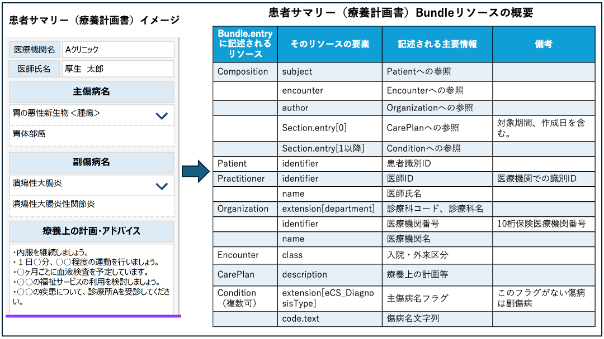

### 実装ガイドと仕様書

実装ガイドとは、HL7FHIR（以下、単に「FHIR」という）に準拠して記述するための仕様と、注意点や使用するコードなど、システムを実装するために必要な技術的情報をまとめたもので、FHIRリソースの構造的な情報や、仕様の元となっているFHIR R4.0.1(https://hl7.org/fhir/R4/)、JP-Core（https://jpfhir.jp/fhir/core/）からの異なっている点などを、人が理解するとともに、計算機が記述されたデータの仕様適合性を検証（バリデーション）する目的などで利用される。

### 患者サマリー（療養計画書）　DRAFT

 
患者サマリー（療養計画書）は、下図左側の情報をひとつのBundleリソースで記述する。Bundleリソースのentry要素に格納されるリソースは、下図右側に概要を示すようように、目次に相当するCompositionリソースと、その各要素からUUIDで参照されるリソースから構成される。 

| 患者サマリー（療養計画書）　Bundleリソース概要図 |
| ---- |
|  |

  
Bundleリソース、Compositionリソース、およびその他の各リソースの詳細は以下より参照できる。

  1.  [患者サマリー（療養計画書）　Bundleリソース][JP_Bundle_ePCS]
  1.  [構成情報　Compositionリソース][JP_Composition_ePCS]
  1.  [患者情報	Patientリソース][JP_Patient_eCS]
  1.  [医療者情報　Practitionerリソース][JP_Practitioner_eCS]
  1.  [医療機関・診療科情報　Organizationリソース][JP_Organization_eCS]
  1.  [外来・入院情報	Encounterリソース][JP_Encounter_eCS]
  1.  [診療計画情報	CarePlanリソース][JP_CarePlan_ePCS]
  1.  [傷病名情報	Conditionリソース][JP_Condition_eCS]

#### 患者サマリー（療養計画書）　DRAFT データ作成例

  1. [高血圧外来での療養計画例](https://jpfhir.jp/fhir/clins/ig/Bundle-Bundle-CLINS-PCS-Example-01.html)

患者サマリー（療養計画書）は、電子カルテ情報共有サービスにおいて、5情報送信で受信した検体検査結果、診療情報提供書に記述された処方情報、電子処方箋で取得した処方情報から、医療機関番号および医師ID、日付が一定の範囲の情報と紐付けされて利用（表示）される予定となっている。

